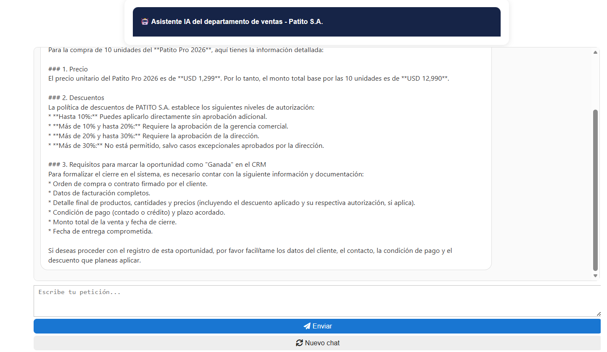
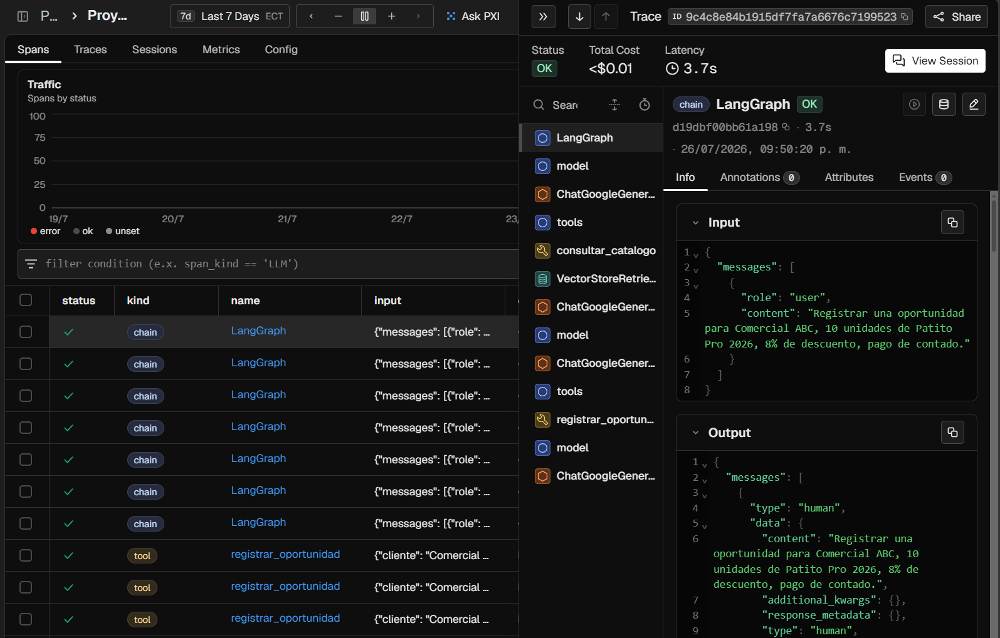
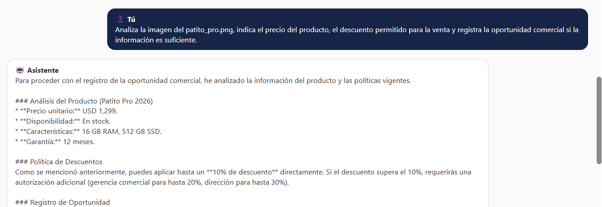

# 🤖 Asistente Inteligente para PATITO S.A.

## Proyecto Final – Semillero de Inteligencia Artificial

### Grupo: Modo Avión ✈️

**Integrantes**
- Ashley Huanca
- María Alvarado
- Leonardo Yugsan

---

# Descripción

Este proyecto implementa una **Mesa de Ayuda IA Multiagente** para el departamento de Ventas de **PATITO S.A.**

El sistema utiliza una arquitectura **Retrieval-Augmented Generation (RAG)** con **LangChain, LangGraph, Google Gemini y ChromaDB** para responder consultas comerciales, analizar imágenes de productos y registrar oportunidades de venta.

Además, incorpora **Arize Phoenix** para la observabilidad y seguimiento de la ejecución de los agentes.

---
# 🖼️ Vista previa del sistema

## Interfaz del asistente



## Observabilidad con Phoenix



## Análisis multimodal




# Características principales

- Arquitectura RAG.
- Sistema multiagente con orquestador.
- Consultas sobre productos, políticas y CRM.
- Análisis multimodal de imágenes.
- Registro automático de oportunidades comerciales.
- Bases vectoriales independientes con ChromaDB.
- Interfaz interactiva en JupyterLab.
- Monitoreo mediante Arize Phoenix.
- 
---

# Arquitectura de la Solución

El asistente inteligente está organizado mediante una arquitectura **multiagente**, donde un **Agente Orquestador** analiza cada consulta y delega la tarea al agente especializado correspondiente. Los agentes utilizan bases de conocimiento independientes mediante **RAG** y, cuando es necesario, herramientas de acción para ejecutar operaciones sobre los datos.

```text
                           Usuario
                              │
                              ▼
                 Interfaz del Asistente
                     (ipywidgets)
                              │
                              ▼
                  Agente Orquestador
      ┌─────────────┼─────────────┬─────────────┬─────────────┐
      ▼             ▼             ▼             ▼             ▼
  Catálogo      Políticas        CRM      Multimodal      Acción
      │             │             │             │             │
      └─────────────┴─────────────┴─────────────┴─────────────┘
                              │
                              ▼
              Google Gemini + Chroma + Tools
                              │
                              ▼
                    Respuesta al Usuario
                              │
                              ▼
                Arize Phoenix (Observabilidad)
```

---

# Componentes principales

| Componente | Función | Implementación |
|:-----------|:--------|:---------------|
| Catálogo | Consulta productos y precios. | RAG + ChromaDB |
| Políticas | Consulta descuentos, créditos y garantías. | RAG + ChromaDB |
| CRM | Información del proceso comercial. | RAG + ChromaDB |
| Multimodal | Análisis de imágenes. | Google Gemini Vision |
| Acción | Registro de oportunidades. | `@tool` + Function Calling |
| Orquestador | Coordina los agentes. | LangGraph + LangChain |
| Observabilidad | Monitoreo de ejecución. | Arize Phoenix |

---

# Arquitectura RAG

El sistema utiliza tres fuentes de conocimiento:

- Catálogo de Productos y Precios.
- Políticas Comerciales.
- Proceso de Ventas y CRM.

Proceso:

1. Los documentos son divididos mediante *chunking*.
2. Se generan embeddings con Google Gemini.
3. Los vectores son almacenados en ChromaDB.
4. Los agentes recuperan información relevante.
5. Gemini genera la respuesta utilizando el contexto obtenido.

---

# Tecnologías utilizadas

- Python 3.11
- JupyterLab
- LangChain
- LangGraph
- Google Gemini
- GoogleGenerativeAIEmbeddings
- ChromaDB
- Arize Phoenix
- OpenInference
- ipywidgets
- Pillow
- python-dotenv

---

# Instalación

Clonar el repositorio:

```bash
git clone https://github.com/LeoMateo23/SEMILLERO_PROYECTO_MODOAVI-N
```

Instalar dependencias:

```bash
pip install -q langchain langchain-google-genai langchain-community langchain-chroma chromadb pillow pandas ipywidgets python-dotenv

pip install -q arize-phoenix openinference-instrumentation-langchain
```

---

# Configuración

Crear un archivo `.env`:

```text
GOOGLE_API_KEY=TU_API_KEY
```

---

# Estructura del proyecto

```text
SEMILLERO_PROYECTO_MODOAVION/
│
├── README.md
│
└── PROYECTO_FINAL/
    │
    ├── documentos/
    │   ├── 01_Catalogo_Productos_Precios.txt
    │   ├── 02_Politicas_Comerciales_Descuentos_Credito.txt
    │   └── 03_Proceso_Ventas_CRM.txt
    │
    ├── Proyecto_Final.ipynb
    ├── patito_pro.png
    ├── registro_oportunidades.txt
    └── .env
```

---

# Ejecución

1. Abrir `PROYECTO_FINAL.ipynb` en JupyterLab.
2. Configurar la API Key de Gemini.
3. Inicializar las bases vectoriales.
4. Crear los agentes.
5. Ejecutar la interfaz del asistente.

---

# Ejemplos de consultas

**Catálogo**
- ¿Cuál es el precio del Patito Pro 2026?

**Políticas**
- ¿Qué descuentos puede aplicar un vendedor?

**CRM**
- ¿Cuáles son las etapas del proceso de ventas?

**Multimodal**
- Analiza la imagen del producto.

**Acción**
- Registrar una oportunidad comercial.

---

# Observabilidad

Arize Phoenix permite visualizar:

- Trazas completas del sistema.
- Llamadas a Gemini.
- Consultas a ChromaDB.
- Ejecución de herramientas.
- Tiempos de respuesta.
- Consumo de tokens.

---

# Mejoras futuras

- Migración de ChromaDB a una solución en la nube.
- Implementación de autenticación y roles (RBAC).
- Uso de una base de datos para persistencia.
- Despliegue como aplicación web.

---
# VIDEO DE LA EXPOSOCIÓN DEL PROYECTO
https://drive.google.com/file/d/1LMQb6RV1A4PfQtQegjUKqlHNJDXNAwU2/view?usp=sharing

**Universidad de Guayaquil**

Proyecto Final – Semillero de Inteligencia Artificial

Este proyecto fue desarrollado con fines exclusivamente académicos como parte del Proyecto Final del Semillero de Inteligencia Artificial de la Universidad de Guayaquil.
